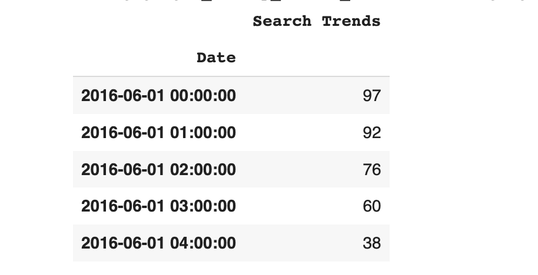
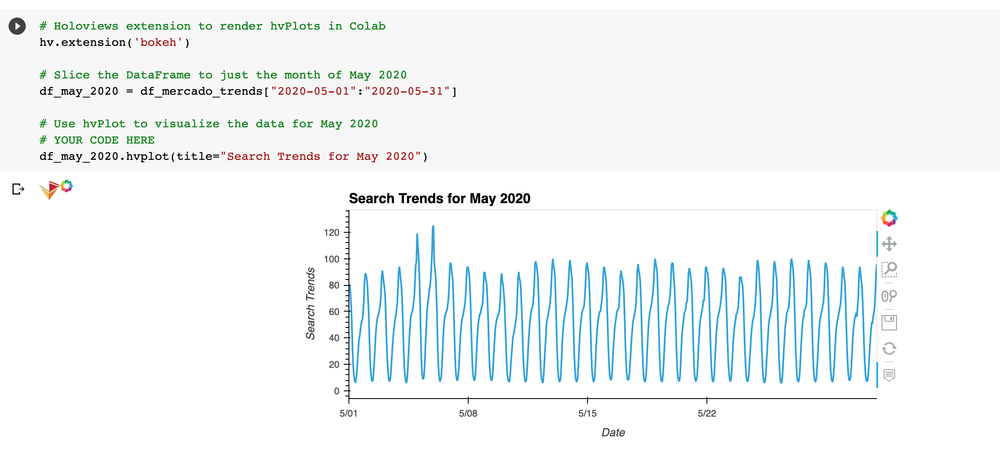
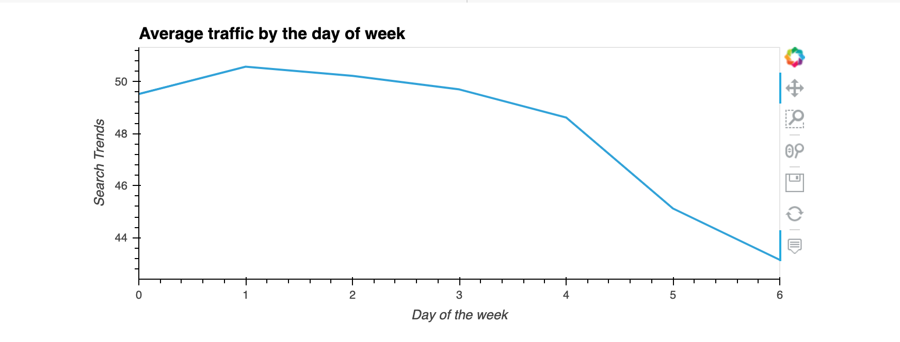
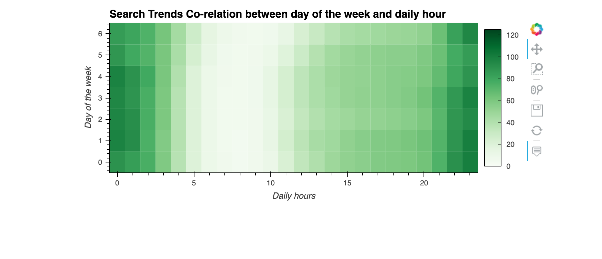
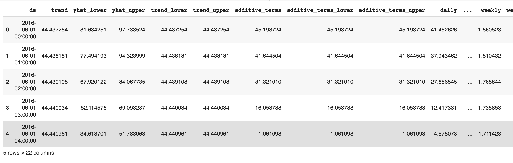
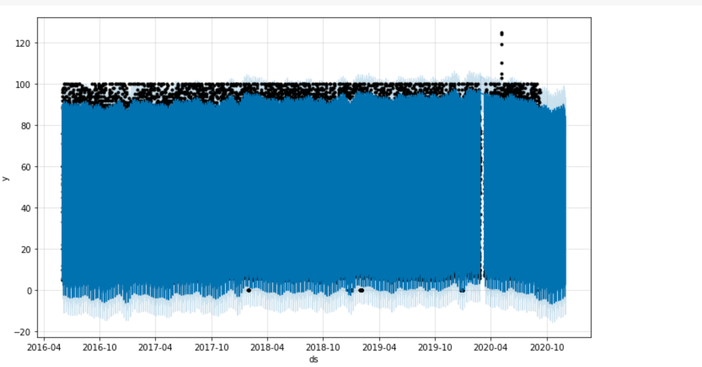
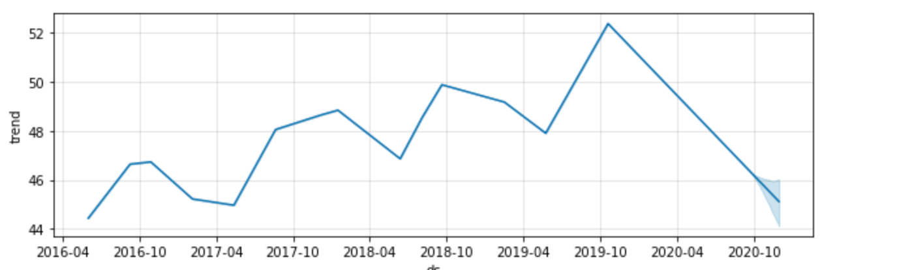

# Week-11-FB-Prophet
Time Series involves a sequence of data over a span of period. Time series analysis, on the other hand, involves making statistical analyis of the data to predict the future estimates. Here, we use different functions and tools made available to us by python and pandas to make time series estimates. Similarly, we will also be utilizing Facebook's algorithm that forecasts time series using the exisiting data.

The data we will be using is centered around Mercado Libre,  a popular e-commerce site in Latin America. Our data contains information such as serach trend numbers, revenues, and stock prices. Using different time series tools, we will be performing different calculations.

---

# Technology and Installations

The program was written in Python using Google Colab platform which enabled us to use Fb Prophet for our cause. 

The required installations include:
* Pystan 
* Fb Prophet
* holoviews
* hvplot

[For more information on FB Prophet](https://github.com/facebook/prophet)

The following functions and libraries were required to run the program: 
* pandas
* Prophet from fbprophet
* hvplot
* datetime

To call upon the libraries the following codes were used:

    import pandas as pd
    import holoviews as hv
    from fbprophet import Prophet
    import hvplot.pandas
    import datetime as dt
    %matplotlib inline
    
# Program functioning:
The programed used Pandas to manipulate data and extract the dataframes that we needed.

---
'hvplot' enabled data visualizations at many levels

---
'fb prophet' was used to fit the datas and make predictions

---
Babin Shrestha